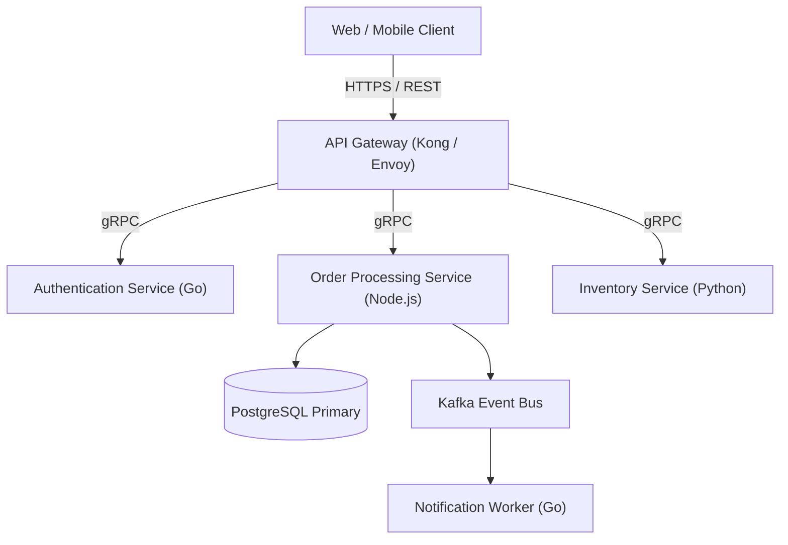
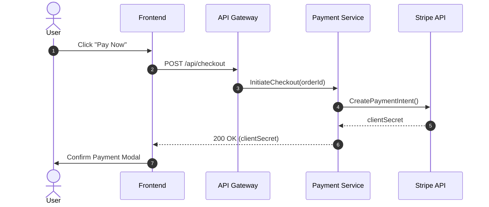

# C4 Model & Mermaid Diagram Examples

## Example: Microservices Architecture

```mermaid
graph TD
    Client["Web / Mobile Client"] -->|HTTPS / REST| Gateway["API Gateway (Kong / Envoy)"]
    Gateway -->|gRPC| AuthSvc["Authentication Service (Go)"]
    Gateway -->|gRPC| OrderSvc["Order Processing Service (Node.js)"]
    Gateway -->|gRPC| InventorySvc["Inventory Service (Python)"]

    OrderSvc --> DB[(PostgreSQL Primary)]
    OrderSvc --> Queue["Kafka Event Bus"]
    Queue --> NotificationSvc["Notification Worker (Go)"]
```

## Example: Event Sequence Diagram

```mermaid
sequenceDiagram
    autonumber
    actor User
    participant Frontend
    participant API as API Gateway
    participant Svc as Payment Service
    participant Stripe as Stripe API

    User->>Frontend: Click "Pay Now"
    Frontend->>API: POST /api/checkout
    API->>Svc: InitiateCheckout(orderId)
    Svc->>Stripe: CreatePaymentIntent()
    Stripe-->>Svc: clientSecret
    Svc-->>Frontend: 200 OK (clientSecret)
    Frontend->>User: Confirm Payment Modal
```
